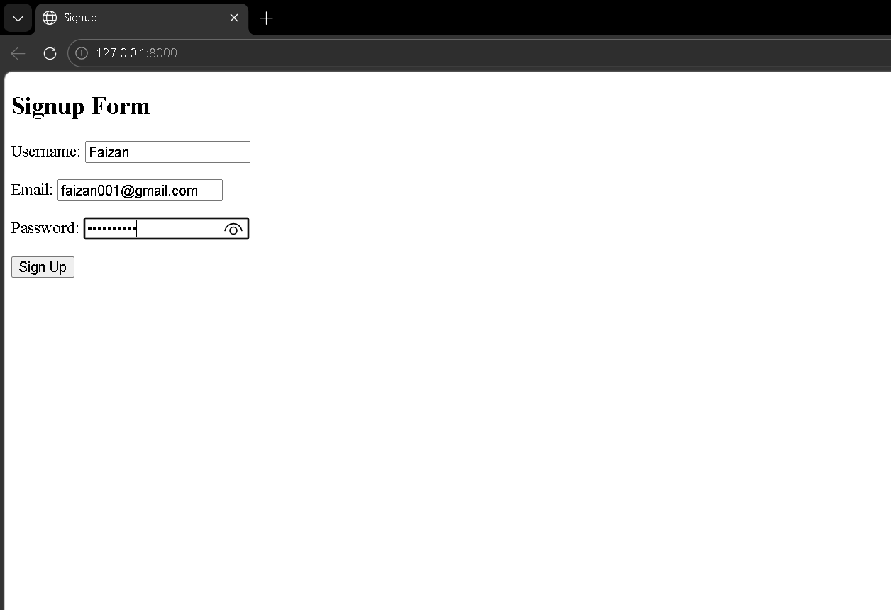
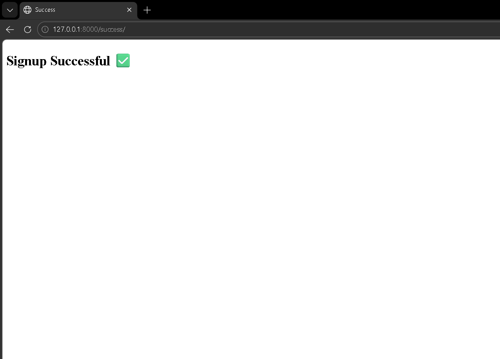
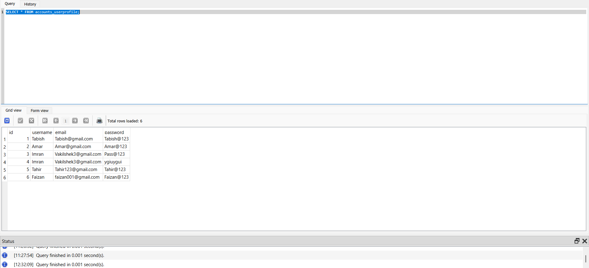

# Django Signup Project

A user registration system built using Django. This project demonstrates form handling, validation, and database integration, and is deployed as a live web application.

---

## Live Demo

https://django-signup-project.onrender.com

---

## Screenshots

**Signup Page**


**Success Page**


**Database Updated**



---

## Features

* User signup form
* Form validation
* Data stored in SQLite database
* Success page after registration
* Simple and clean user interface

---

## Tech Stack

* Backend: Python, Django
* Frontend: HTML, CSS
* Database: SQLite
* Deployment: Render
* Version Control: Git, GitHub

---

## Project Structure

```
Sign_up/
├── accounts/          
├── Sign_up/           
├── templates/         
├── screenshots/       
├── manage.py          
├── requirements.txt   
└── Procfile           
```

---

## How to Run Locally

1. Clone the repository:

```
git clone https://github.com/your-username/django-signup-project.git
cd django-signup-project
```

2. Create virtual environment:

```
python -m venv venv
venv\Scripts\activate
```

3. Install dependencies:

```
pip install -r requirements.txt
```

4. Run migrations:

```
python manage.py migrate
```

5. Start server:

```
python manage.py runserver
```

Open in browser:
http://127.0.0.1:8000/

---

## Deployment

The project is deployed on Render using Gunicorn and integrated with GitHub for continuous deployment.

---

## Future Improvements

* User login and authentication
* Password hashing
* Email verification
* User dashboard

---

## Author

Imran Shaikh
